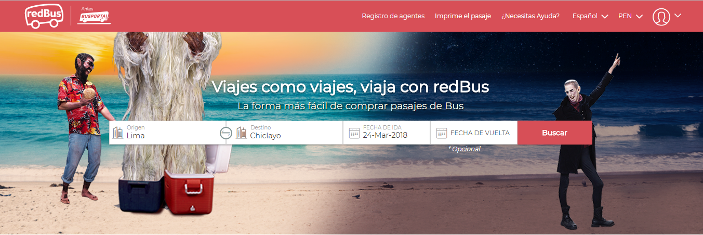
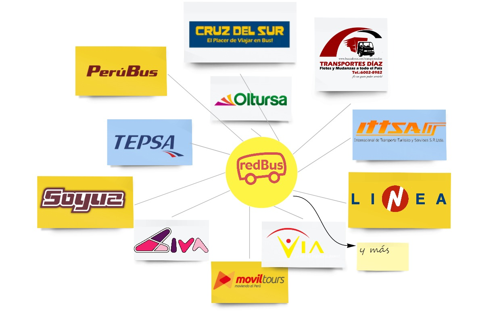
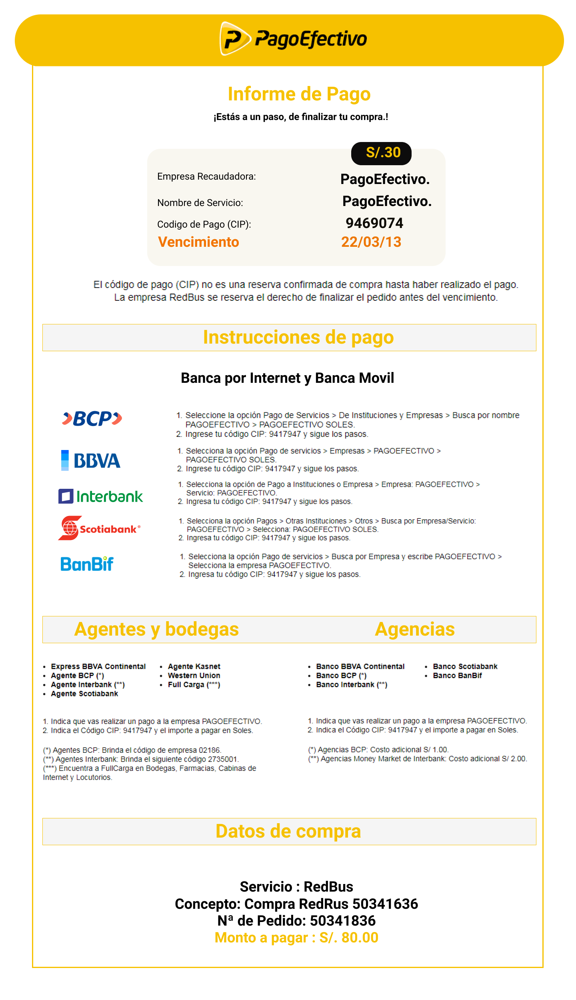

# RedBus

 

## Objetivo
- Maquetar y dar funcionalidad a una página responsiva de confirmación de la pasarela Pago Efectivo, la página brindara mayor conversión a las ventas realizadas en Pago Efectivo y Banca Online.

## Proceso de Diseño

### Planeamiento
### Stakeholders
- CEO.
- Product Manager
- Departamento de Innovación, creatividad o desarrollo.
- Departamento de Diseño.
- Departamento de finanzas.
- Principal-Usuarios.
-
## Descubrimiento.
## Research

- El reto ya esta puesto en marcha, por lo tanto no podremos profundizar en el reseach, sin embargo en el benchMarking queda claro que RedBus tiene muchos competidores que al mismo tiempo, llegan a ser sus socios estratégicos, detallo gráfica.

 

#### PROTOTIPO.
 

#### MODELO AFFINITY MAP.
 

#### MODELO PROBLEM STATEMENT.
 

#### USER PERSONA
 

### IDEACION
### 1ER PROTOTIPO.
 

### Storytelling
 

### TESTEO.

### PROTOTIPO
https://marvelapp.com/14gdic76/screen/39992875

