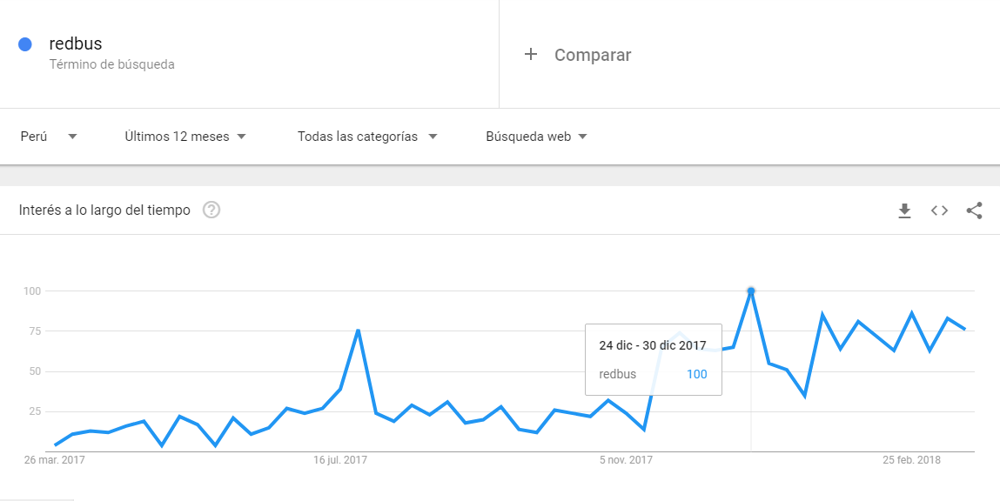
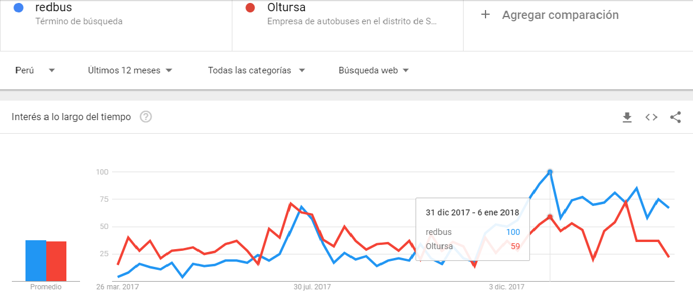
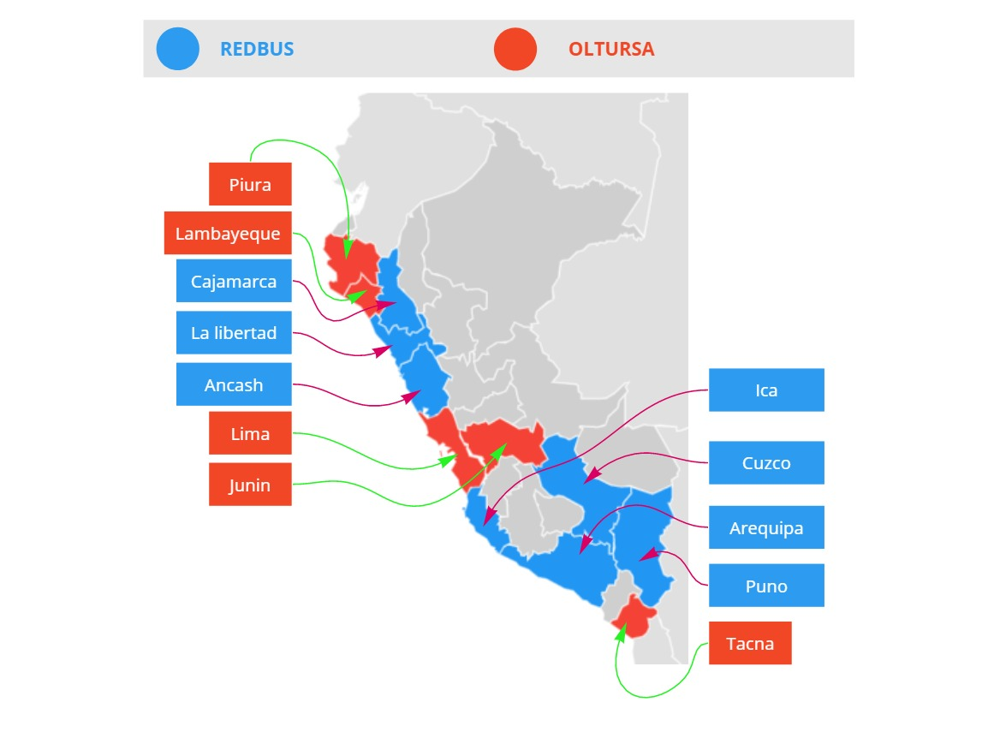
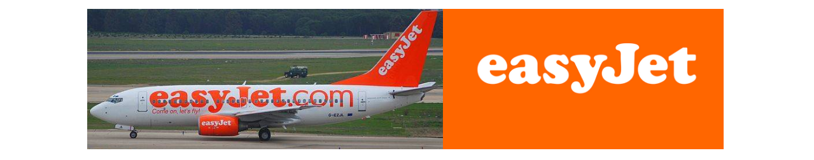

# RedBus

 

## Objetivo
- Maquetar y dar funcionalidad a una página responsiva de confirmación de la pasarela Pago Efectivo, la página brindara mayor conversión a las ventas realizadas en Pago Efectivo y Banca Online.

### Planeamiento
### Stakeholders
- CEO.
- Product Manager
- Departamento de Innovación, creatividad o desarrollo.
- Departamento de Diseño.
- Departamento de finanzas.
- Principal-Usuarios.

## Investigación.
## Research
### BenchMarking
- Queda claro que RedBus tiene muchos competidores que al mismo tiempo, llegan a ser sus socios estratégicos, detallo gráfica.

 

### Estadísticas según Google Trends.

 

 

 

Red Bus inicia sus ventas de pasaje Online en 2016, no tiene mucho tiempo en la red, sin embargo está ocupando los primeros lugares de búsquedas de pasajes online y tiende a seguir subiendo. Según las estadísticas de Google Trends, Red Bus en comparación con la agencia de transporte turística Oltursa(tomada al azar), en el año  2017, mostro una mayor venta de pasajes online, a diferentes provincias de Perú. La mayor afluencia de visitas online a RedBus son a lugares turísticos, como Cuzco, Ica, Arequipa, Cajamarca, Trujillo, Ancash.
- https://elcomercio.pe/economia/negocios/startup-peruana-busportal-comprada-empresa-india-237725

### Empresas exitosas que mejoraron sus ventas de pasajes online mediante procesos UX.
http://techcetera.co/las-grandes-empresas-apuestan-por-invertir-en-ux/

- Virgin American.
    Cuando en 2013 les llegó el momento de emprender el rediseño del sitio de compra de pasajes de avión, en lugar de hacer un rediseño superficial, decidieron relanzarlo con un nuevo objetivo de negocio: agilizar el proceso de compra de pasajes de avión a través de dispositivos móviles y transformarlo en una experiencia atractiva para los usuarios. 
   - http://www.kambrica.com/blog/empresas-con-foco-en-ux-virgin-america/

 

- Easy Jet`s.
    Easy Ject, otra de las grandes empresas de ventas de pasajes en avión que lograron ser exitosas despues de rediseñar el lugar de ventas de pasajes online, crear una pagina responsive. Easy Jet´s nos dice: "Nuestra asociación se basa en un enfoque implacable en los clientes, las oportunidades de tecnología y la entrega digital".
    - https://www.webcredible.com/case-studies/travel/easyjet/

 

#### Prototipo.
#### Prototipo.
 

#### MODELO AFFINITY MAP.
 

#### MODELO PROBLEM STATEMENT.
 

#### USER PERSONA
 

### IDEACION

#### USER FLOW
 

### 1ER PROTOTIPO.
 

### Storytelling
 

### TESTEO.

### PROTOTIPO

